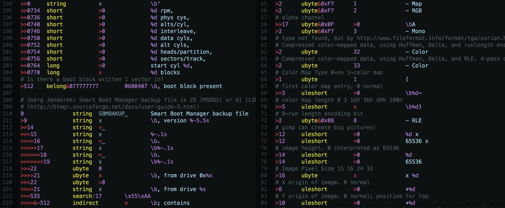

File Magic Highlighting
=======================

Adds syntax highlighting for [**magic**(5)][5] pattern data, used by the [**file**(1)][1] program.

[1]: https://linux.die.net/man/1/file
[5]: https://linux.die.net/man/5/magic
